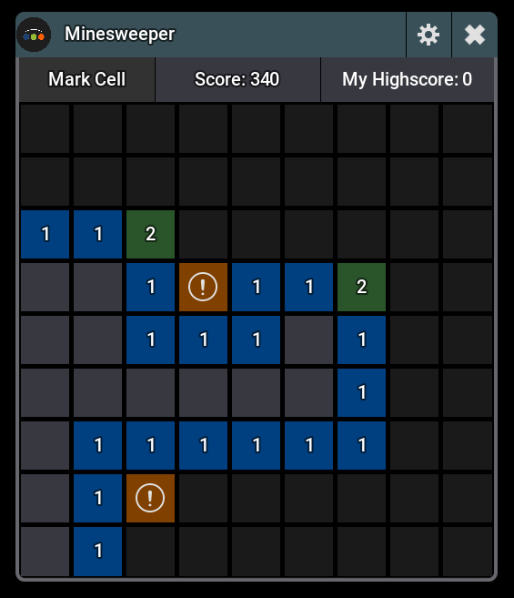

# Minesweeper `v1.0.0`

Classic Minesweeper for grandMA3. Mines are placed after the first click — the first reveal is always safe.

**[← Back to all plugins](../../README.md)**

---

## Features

| Feature | Description |
|---|---|
| **Easy** | 9×9 grid, 10 mines |
| **Medium** | 16×16 grid, 40 mines |
| **Hard** | 16×30 grid, 99 mines |
| **First-click safety** | Mines placed after first click, avoiding the clicked area |
| **Flag Mode** | Toggle to place/remove flags instead of revealing |
| **Chord Reveal** | Click a revealed number whose adjacent flags match its count to auto-reveal neighbors |
| **Score** | +10 per revealed cell, time bonus on win |
| **Highscore** | Best score saved per difficulty, persists across sessions |

---

## Screenshot

<table>
  <tr>
    <td></td>
  </tr>
  <tr>
    <td align="center">Game</td>
  </tr>
</table>

---

## Changelog

See [CHANGELOG.md](CHANGELOG.md)
