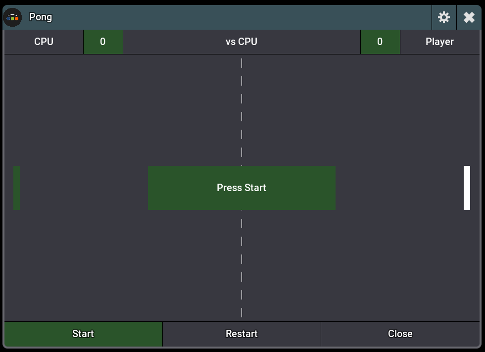
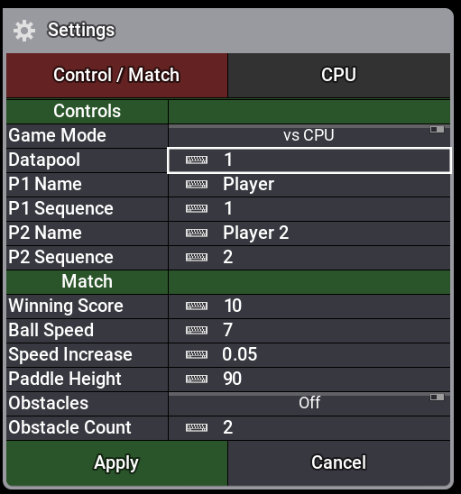

# Pong `v1.3.0`

A fully-featured Pong game for grandMA3. Control your paddle with a playback master fader.

**[← Back to all plugins](../../README.md)**

---

## Features

- **vs CPU** or **2-Player** mode
- Paddle controlled via playback master fader (configurable sequence + datapool)
- Configurable ball speed, speed increase per hit, paddle height, win score
- Obstacles mode — bouncing obstacles that add difficulty
- CPU with adjustable speed and accuracy
- Smooth pixel-precise rendering via layered UILayoutGrids

---

## Screenshots

<table>
  <tr>
    <td></td>
    <td></td>
  </tr>
  <tr>
    <td align="center">Game</td>
    <td align="center">Settings</td>
  </tr>
</table>

---

## Changelog

See [CHANGELOG.md](CHANGELOG.md)
