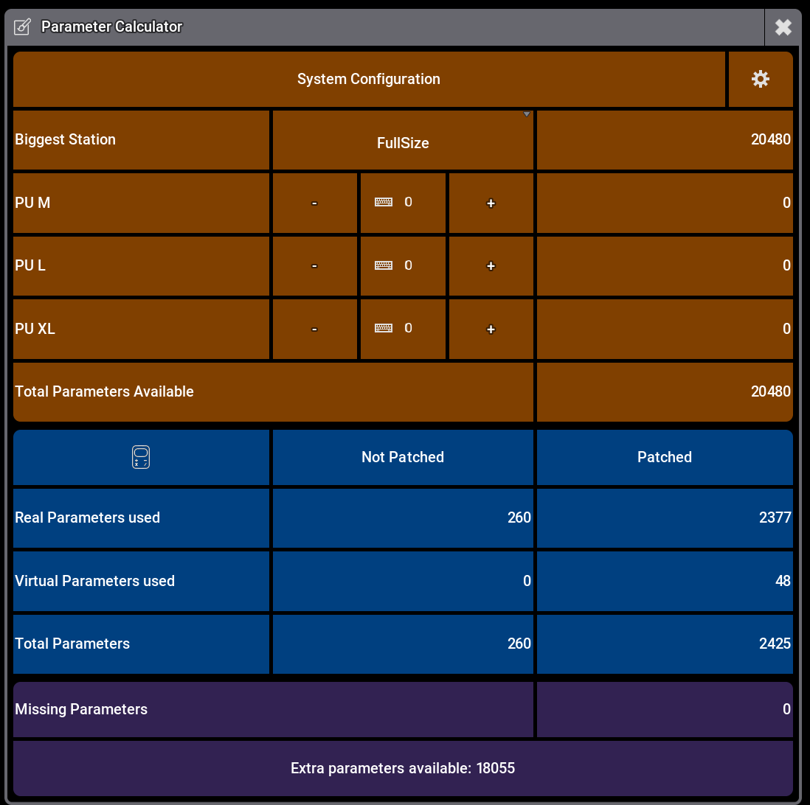
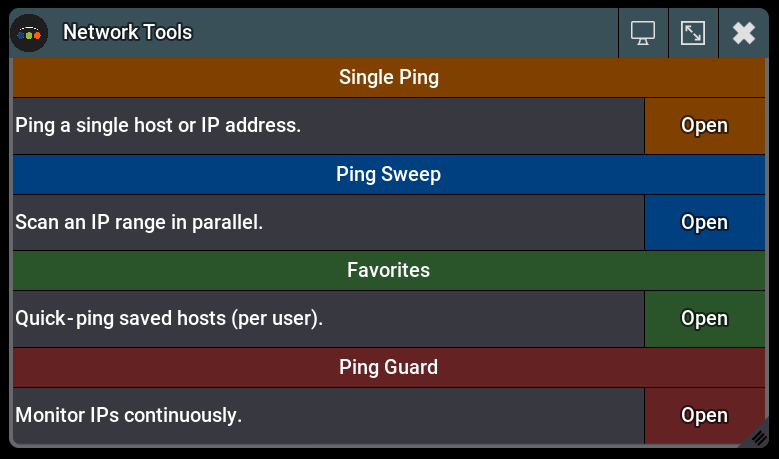
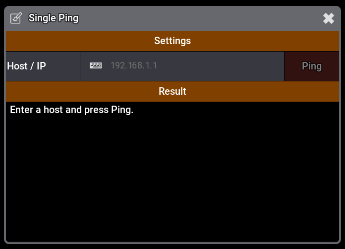
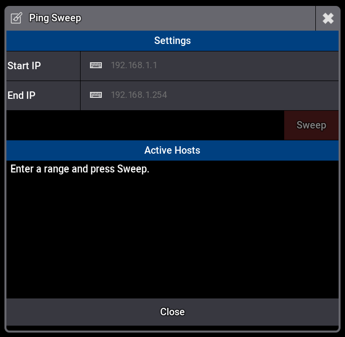
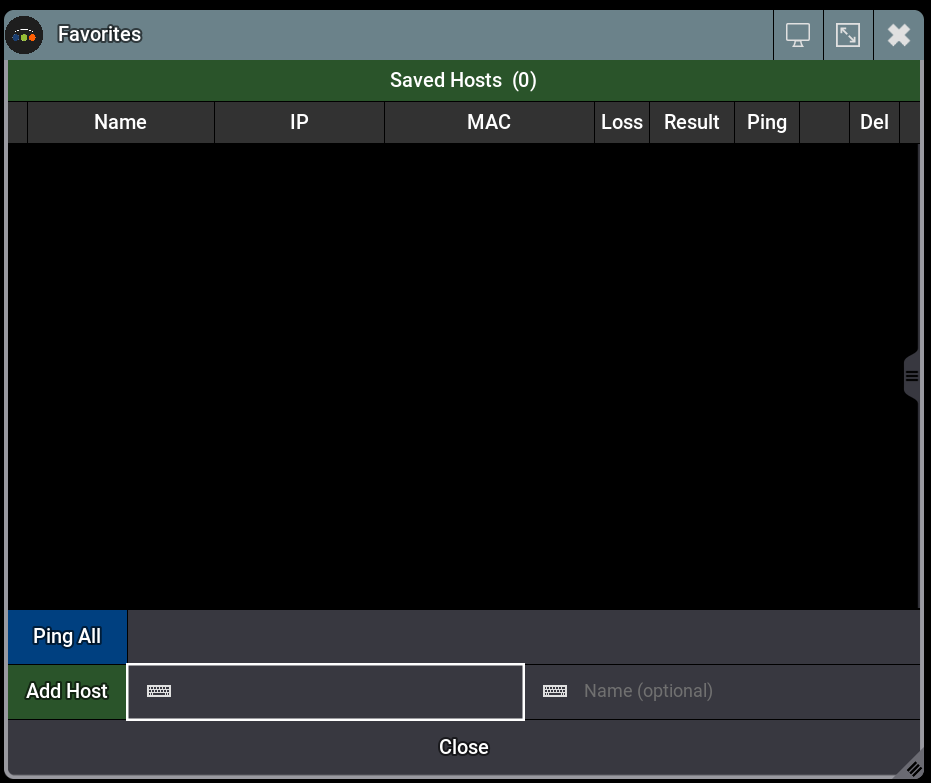
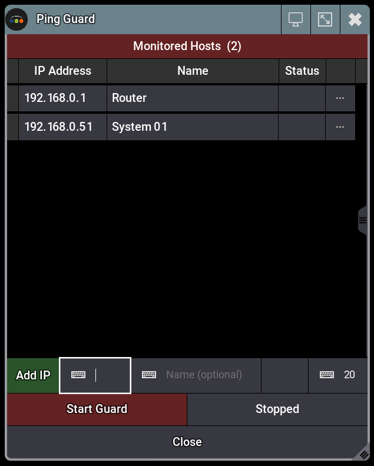
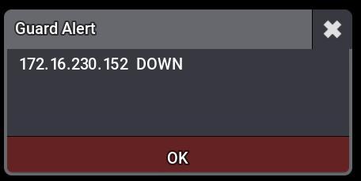

# GrandMA3 Plugins

A collection of free, open-source plugins for **grandMA3** lighting consoles.

**Author:** t-60
**Tested on:** grandMA3 2.3.2.0
**License:** [t-60 Non-Commercial](LICENSE) — free to use, even on paid jobs. See license for details.

---

## Available Plugins

| Category | Plugin | Version |
|---|---|---|
| Parameter | [Parameter Calculator](Parameter-Calculator/) | `v3.0.1` |
| Network | [Network Tools](Network-Tools/) | `v3.1.1` |
| Games | [Pong](Pong/) | `v1.3.0` |

---

## Parameter

### [Parameter Calculator](Parameter-Calculator/) `v3.0.1`

Counts real and virtual DMX parameters of all fixtures in the show. Calculates how many Parameter Units (PU M/L/XL) you need to cover the show.

<table>
  <tr>
    
  </tr>
  <tr>
    <td align="center">Calculator</td>
  </tr>
</table>

---

## Network

### [Network Tools](Network-Tools/) `v3.1.1`

A suite of network diagnostic tools for grandMA3. All operations run asynchronously — the UI thread is never blocked.

| Tool | Description |
|---|---|
| **Single Ping** | Ping any host or IP address, see full output |
| **Ping Sweep** | Scan a full /24 range in parallel, add results directly to Favorites |
| **Favorites** | Save hosts by name, quick one-click ping, stored per user |
| **Ping Guard** | Continuously monitor a list of IPs in the background, popup alert when a host goes down or comes back up |

<table>
  <tr>
    <td></td>
    <td></td>
    <td></td>
  </tr>
  <tr>
    <td align="center">Launcher</td>
    <td align="center">Single Ping</td>
    <td align="center">Ping Sweep</td>
  </tr>
  <tr>
    <td></td>
    <td></td>
    <td></td>
  </tr>
  <tr>
    <td align="center">Favorites</td>
    <td align="center">Ping Guard</td>
    <td align="center">Guard Alert</td>
  </tr>
</table>

---

## Games

### [Pong](Pong/) `v1.3.0`

A fully-featured Pong game for grandMA3. Control your paddle with a playback master fader. Supports CPU and 2-Player mode, configurable ball speed, paddle height, obstacles, and smooth pixel-precise rendering.

<table>
  <tr>
    <td></td>
    <td></td>
  </tr>
  <tr>
    <td align="center">Game</td>
    <td align="center">Settings</td>
  </tr>
</table>

---

## Requirements

- grandMA3 **2.3.2.0** or newer (earlier versions may work but are untested)

---

## Issues & Feedback

Found a bug or have a feature request?
[Open an issue](https://github.com/tminus60/GrandMA3-Plugins/issues)

---

## License

These plugins are **free to use** — including for paid professional work such as live shows, events, and tours.

**Not permitted:**
- Selling these plugins or any modified version
- Including them in paid products or services
- Republishing them under a different name

See [LICENSE](LICENSE) for full terms.
