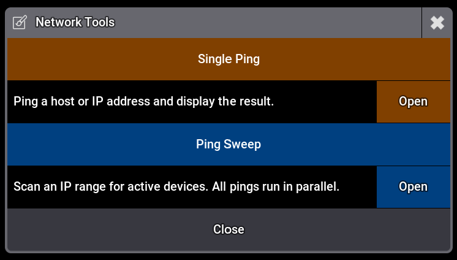

# GrandMA3 Plugins

A collection of free, open-source plugins for **grandMA3** lighting consoles.

**Author:** t-60
**Tested on:** grandMA3 2.3.2.0
**License:** [t-60 Non-Commercial](LICENSE) — free to use, even on paid jobs. See license for details.

---

## Available Plugins

### Parameter

#### [Parameter Calculator](Parameter-Calculator/) `v3.0.0`
Counts real and virtual DMX parameters of all fixtures in the show. Calculates how many Parameter Units (PU M/L/XL) you need to cover the show.

---

### Network

#### [Network Ping](Network/Ping/) `v2.2.0`
Ping a single host or sweep an entire IP range to find all active devices. Sweep runs all pings in parallel — a full /24 takes ~3 seconds.

---

## Requirements

- grandMA3 **2.3.2.0** or newer (earlier versions may work but are untested)

---

## Issues & Feedback

Found a bug or have a feature request?
[Open an issue](https://github.com/tminus60/GrandMA3-Plugins/issues)

---

## License

These plugins are **free to use** — including for paid professional work such as live shows, events, and tours.

**Not permitted:**
- Selling these plugins or any modified version
- Including them in paid products or services
- Republishing them under a different name

See [LICENSE](LICENSE) for full terms.
