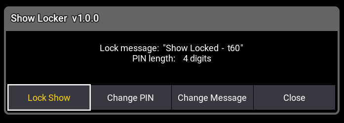
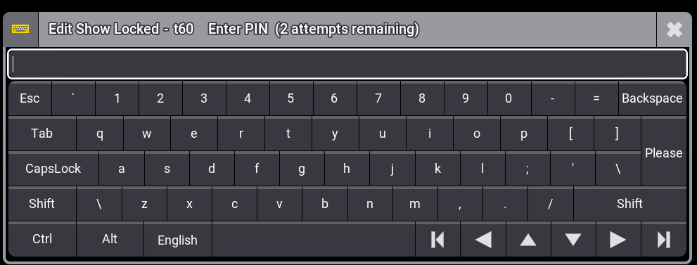

# Show Locker `v1.0.0`

Locks the grandMA3 show with a PIN code. Uses GMA3's native blocking TextInput modal — nothing in the background can be interacted with while locked.

**[← Back to all plugins](../README.md)**

---

## Features

| Feature | Description |
|---|---|
| **3-attempt limit** | After 3 wrong PINs the current show is saved and a new empty show is loaded |
| **Configurable PIN** | Set any PIN, stored persistently in GlobalVars |
| **Configurable message** | Custom lock screen message shown during each PIN prompt |
| **Show save** | Current show is saved as `Showlock` before wiping — data is not permanently lost |

---

## Screenshots

<table>
  <tr>
    <td></td>
    <td></td>
  </tr>
  <tr>
    <td align="center">Launcher</td>
    <td align="center">Lock Screen</td>
  </tr>
</table>

---

## Usage

1. Run the plugin — a menu appears with Lock Show / Change PIN / Change Message / Close
2. Click **Lock Show** — GMA3's native PIN dialog appears, blocking all background interaction
3. Enter correct PIN to unlock, wrong PIN 3× → show is wiped

> **Default PIN:** `1234`

---

## Changelog

See [CHANGELOG.md](CHANGELOG.md)
